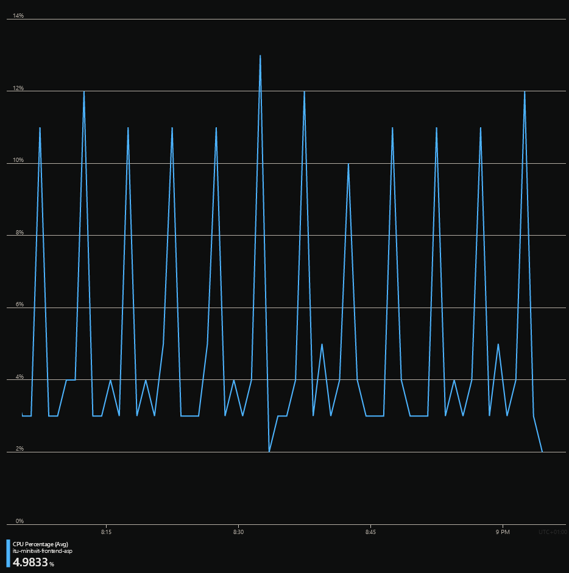
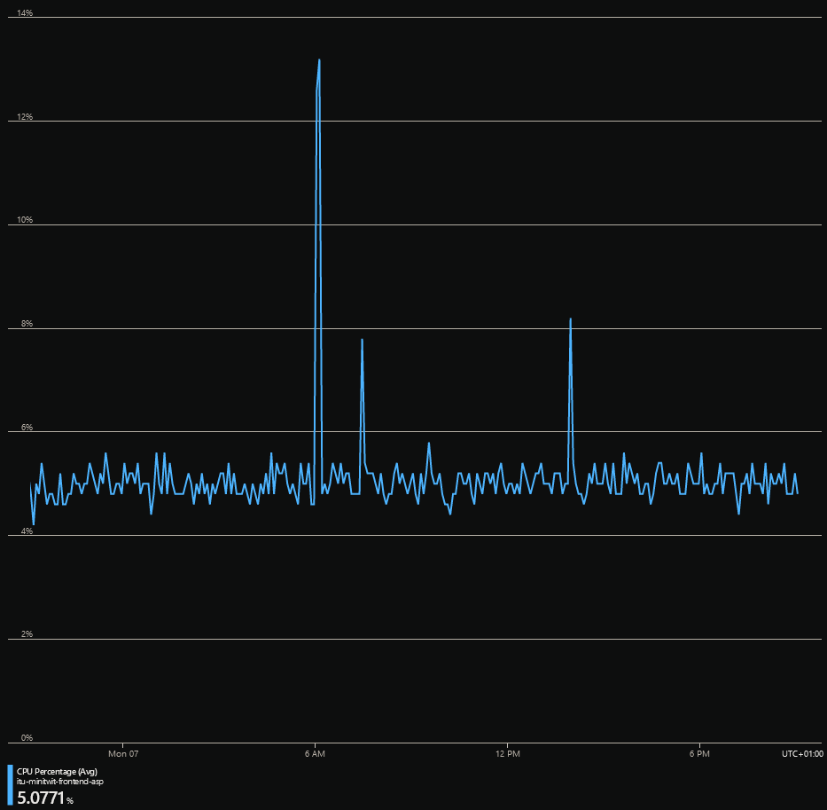
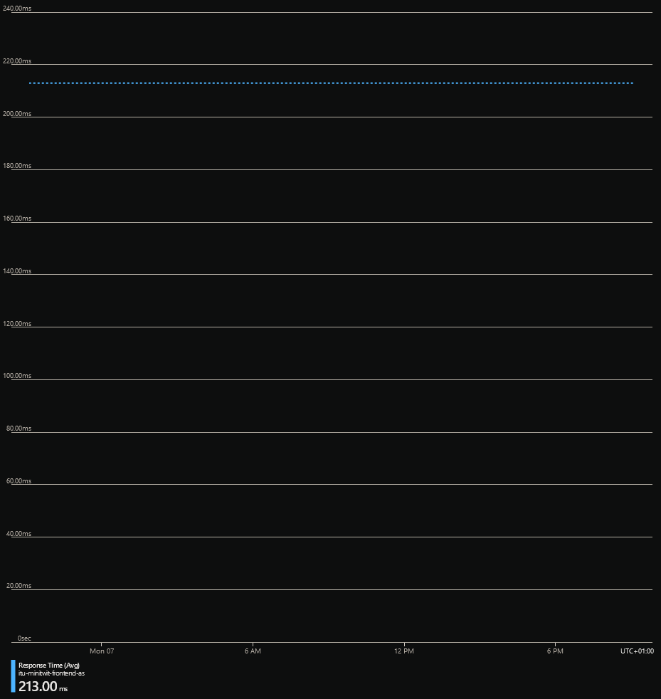

# Session 5 prep
## Figuring out properties
### CPU load during the last hour/the last day
1. Go to the App Service Plan in Azure
2. Go to Metrics
3. See CPU percentage

Last hour:



Last day:



### Average response time of your application's front page

1. Go to the App Service in Azure
2. Go to Metrics
3. See response time



Nobody is using our front page, so it's constant right now.

### Amount of users registered in your system

1. Go to the database in Azure
2. Go to Query Editor
3. Type the following SQL Server query:
   ```sql
   SELECT COUNT(*) FROM [dbo].[user];
   ```

### Average amount of followers a user has

Same place as above but with this query:

```sql
SELECT AVG(x.c)
FROM (
    SELECT COUNT(distinct who_id) as c
    FROM [dbo].[follower]
    GROUP BY whom_id
) as x;
```

## Categorization of metrics

- CPU load - server folks, developers, devops
- Response time - developers, devops
- Amount of users - business, marketing, sales
- Average amount of followers - same as above

All the properties are important depending on the user. Developers may not care about the average number of users, but a sales department or data analysis department might care. For something like the number of users, multiple parties may benefit from it - business folks for developing the biz and developers for knowing the size of database and stuff.

We are in the developer (and operations) role.
