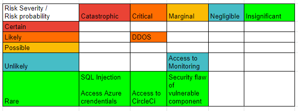
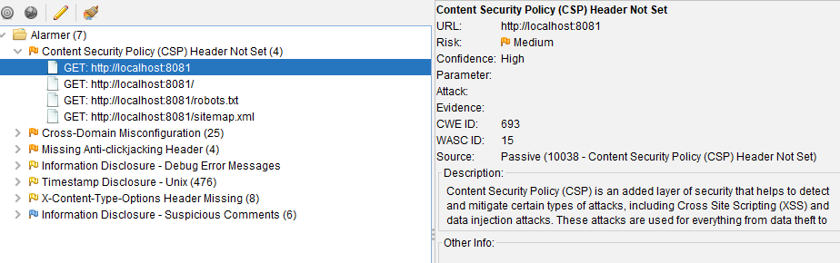
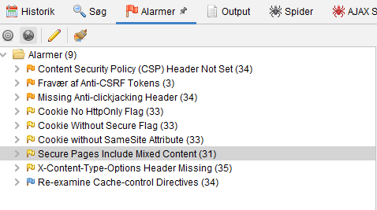

# Perform a Security Assessment
- [ ] Draft - Brief results for report
##  Brief results for report

## A. Risk Identification
### Identify assets
- Data (backend)
- Monitoring (Grafana / Prometheus)
- Flag tool ()
- Azure credentials (Deployment service)
- Front end
- API 

### Identify threat sources
- SQL Injection
- DDOS
- Broken access control
- Vulnerable and Outdated components

### Construct risk scenarios
- Attacker performs DDOS making the service unavailable
- Attacker gains access to the monitoring layer, able to change dashboard, alerts and access business information regarding different endpoints  
- Attacker performs SQL Injection to copy, delete or ransom all data from the Database layer
- Attacker abuses security flaw of a vulnerable component and gains access to unwanted parts of the program
- Attacker gains access to Azure credentials, have complete control over the service, change subscribtion, database, resource group, redirect CI/CD pipeline
- Attack gains Access to CircleCi credentials, edit environment variables, stop the pipeline CI/CD

## B. Risk Analysis

### Risk Matrix

### Discuss what are you going to do about each of the scenarios
- SQL injection solved by using an ORM as middleware between database and input - gorm 
- DDOS Firewall, Maybe introduce a bandwidth cap on end points, to avoid whole system breaking down.
- Security flaw of vulnerable or outdated components. We use Static analysis tools like Snyk encorporated with the pipeline, to be aware about vulnerable dependencies and update the dependencies.
- Access to CircleCi, Access is granted via github user, on github set a requirement on the organisation repository to require 2FA.   
- Access to Azure crendetials, Require MFA for every user.  
- Access to monitoring, Create a team to limit permissions in grafana, add users to the team. 

## C. Pen-Test Your System

### Pen testing steps
- Zaproxy didn't work as intented with kubernetes [simplyzee](https://github.com/simplyzee/kube-owasp-zap)
- Run ZapProxy via the executable targeting Rhododevdron frontpage https://rhododevdron.swuwu.dk/, found a few obscure risks
    -  Missing header settings on the root endpoint (CSP, Anti-clickjacking Header, X-Content-Type-Options Header, Incomplete or No Cache-control Header) 
    - But the rest of our endpoints are fine

#### We tried to add an extra middleware to fix the header issues on the root endpoint but to no success, we accessed the risk to be minimal.

- Run Metasploit WMAP in a docker container, targeting Rhododevdron frontpage https://rhododevdron.swuwu.dk/ see steps [Session09](./session09.md) under section Metasploit WMAP 
    - Wmap didn't find any vulnerabilites [Wmap notes](./session09_security_WMAP.txt), but made us aware of a certificate issue "Fake ingress controller certificate" on the the root endpoint

### Fix at least one vulnerability or more. (e.g. monitoring access control)
- [ ] Change monitoring password of the admin account to avoid 3rd party access 
- [x] Only allow changes to the monitoring Dashboard through code 
- [ ] Fix the certificate issue on root endpoint

# White Hat Attack group A.
## Pen testing

- We tried SQL injection, but with no luck, seems like they got everything set up nicely in gorm
- They seem to have up to date packages, so finding new exploits is difficult
- We targeted their URL https://minitwit.thesvindler.net with [Zaproxy](https://www.zaproxy.org/download/), see results below

